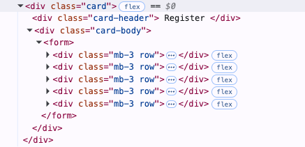

## 登録画面側のコードリーディング
### register.vue
```vue
<template>
  <div class="row">
  <!-- Bootstrapのクラス　 -->
  <!-- resorces/js/components/index.js でインポートされている -->
  <!-- カラムを作るためのもの -->
    <div class="col-lg-7 m-auto">
    <!-- 12分割のうち7つ分の幅 -->
    <!-- 要素を中央寄せ -->
      <card v-if="mustVerifyEmail" :title="$t('register')">
      <!-- card は自分で定義したコンポーネント
      グローバル登録しているから使える？
      `resources/js/components/index.js`でグローバル登録してあるからこのコンポーネント内で個別にimportしなくても利用できる
      mustVerifyEmail ってなんだ？
      mustVerifyEmail: ユーザー登録時にメール認証が必要かどうかを判定する変数
      true ならメール認証を促す
      false なら登録フォームを表示
      現在は mustVerifyEmail は実装されていない -->
        <div class="alert alert-success" role="alert">
          {{ $t('verify_email_address') }}
        </div>
      </card>
      <card v-else :title="$t('register')">
      <!-- 
       `:` は `v-bind:` の省略形で、 `title` プロパティに値を渡している
       翻訳された`register`の文字列を、cardコンポーネントのtitleプロパティに渡す
       -->
        <form @submit.prevent="register" @keydown="form.onKeydown($event)">
        <!-- 
         @submit.prevent="register": フォーム送信時にregisterメソッドを実行し、デフォルトの送信を防ぐ
         @keydown="form.onKeydown($event)": キーが押されたときにform.onKeydown($event)を実行する
         vformはLaravelをバックエンドとして使う際にフォームとバリデーションを便利に使うためのVueのライブラリ
         フォームデータをラップするフォームインスタンスを提供し、axiosを使ってLaravelアプリケーションにHTTPリクエストとして送信できる
         -->
          <!-- Name -->
          <div class="mb-3 row">
            <label class="col-md-3 col-form-label text-md-end">{{ $t('name') }}</label>
            <div class="col-md-7">
              <input v-model="form.name" :class="{ 'is-invalid': form.errors.has('name') }" class="form-control" type="text" name="name">
              <has-error :form="form" field="name" />
            </div>
          </div>

          <!-- Email -->
          <div class="mb-3 row">
            <label class="col-md-3 col-form-label text-md-end">{{ $t('email') }}</label>
            <div class="col-md-7">
              <input v-model="form.email" :class="{ 'is-invalid': form.errors.has('email') }" class="form-control" type="email" name="email">
              <has-error :form="form" field="email" />
            </div>
          </div>

          <!-- Password -->
          <div class="mb-3 row">
            <label class="col-md-3 col-form-label text-md-end">{{ $t('password') }}</label>
            <div class="col-md-7">
              <input v-model="form.password" :class="{ 'is-invalid': form.errors.has('password') }" class="form-control" type="password" name="password">
              <has-error :form="form" field="password" />
            </div>
          </div>

          <!-- Password Confirmation -->
          <div class="mb-3 row">
            <label class="col-md-3 col-form-label text-md-end">{{ $t('confirm_password') }}</label>
            <div class="col-md-7">
              <input v-model="form.password_confirmation" :class="{ 'is-invalid': form.errors.has('password_confirmation') }" class="form-control" type="password" name="password_confirmation">
              <has-error :form="form" field="password_confirmation" />
            </div>
          </div>

          <div class="mb-3 row">
            <div class="col-md-7 offset-md-3 d-flex">
              <!-- Submit Button -->
              <v-button :loading="form.busy">
                {{ $t('register') }}
              </v-button>

              <!-- GitHub Register Button -->
              <login-with-github />
            </div>
          </div>
        </form>
      </card>
    </div>
  </div>
</template>

<script>
import Form from 'vform'
import LoginWithGithub from '~/components/LoginWithGithub'

export default {
  components: {
    LoginWithGithub
  },

  middleware: 'guest',

  metaInfo () {
    return { title: this.$t('register') }
  },

  data: () => ({
    form: new Form({
      name: '',
      email: '',
      password: '',
      password_confirmation: ''
    }),
    mustVerifyEmail: false
  }),

  methods: {
    async register () {
      // Register the user.
      const { data } = await this.form.post('/api/register')
      // /api/register にリクエスト送信

      // Must verify email fist.
      if (data.status) {
        this.mustVerifyEmail = true
        // レスポンスに status があれば true
      } else {
        // Log in the user.
        const { data: { token } } = await this.form.post('/api/login')

        // Save the token.
        this.$store.dispatch('auth/saveToken', { token })

        // Update the user.
        await this.$store.dispatch('auth/updateUser', { user: data })

        // Redirect home.
        this.$router.push({ name: 'home' })
      }
    }
  }
}
</script>

```

### `RegisterController.php`
```php
<?php

namespace App\Http\Controllers\Auth;

use App\Http\Controllers\Controller;
use App\Models\User;
use Illuminate\Contracts\Auth\MustVerifyEmail;
use Illuminate\Foundation\Auth\RegistersUsers;
use Illuminate\Http\Request;
use Illuminate\Support\Facades\Validator;

class RegisterController extends Controller
{
    use RegistersUsers;

    /**
     * Create a new controller instance.
     */
    public function __construct()
    {
        $this->middleware('guest');
    }

    /**
     * The user has been registered.
     */
    protected function registered(Request $request, User $user)
    {
        if ($user instanceof MustVerifyEmail) {
            // MustVerifyEmail を実装していれば
            return response()->json(['status' => trans('verification.sent')]);
            // statusを返す
        }

        return response()->json($user);
        // ユーザー情報のみを返す
    }

    /**
     * Get a validator for an incoming registration request.
     */
    protected function validator(array $data)
    {
        return Validator::make($data, [
            'name' => 'required|max:255',
            'email' => 'required|email:filter|max:255|unique:users',
            'password' => 'required|min:6|confirmed',
        ]);
    }

    /**
     * Create a new user instance after a valid registration.
     */
    protected function create(array $data): User
    {
        return User::create([
            'name' => $data['name'],
            'email' => $data['email'],
            'password' => bcrypt($data['password']),
        ]);
    }
}

```

### `Card.vue`
```vue
<template>
  <div class="card">
    <div v-if="title" class="card-header">
      {{ title }}
    </div>

    <div class="card-body">
      <slot />
    </div>
  </div>
</template>

<script>
export default {
  name: 'Card',

  props: {
    title: { type: String, default: null }
  }
}
</script>

```

## 登録時に走る処理を理解
